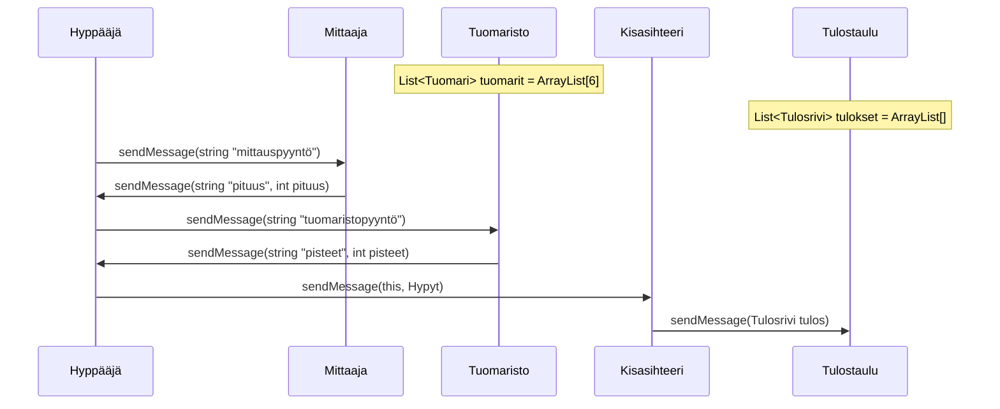
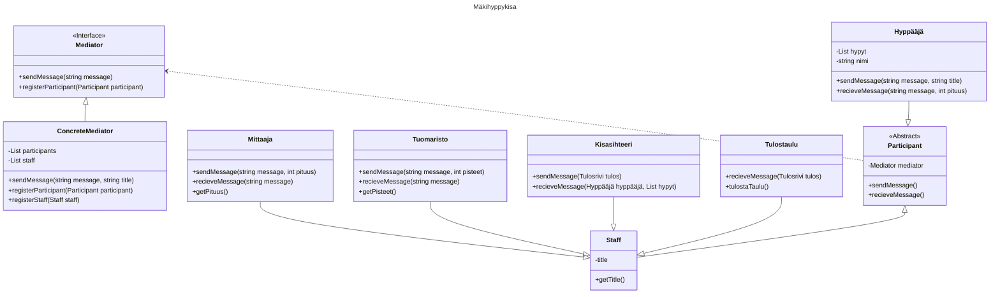

# Mäkihyppykisa

## Hyppääjä

Hyppääjä lähettää mittauspyynnön mittaajalle ja tuomaristopyynnön tuomaristolle. Hyppääjä saa mittauksen pituuden ja tuomaristolta pisteet jolla se luo Hyppy objektin. Kun hypyt lista on valmis, hyppääjä lähettää sen kisasihteerille.

## Mittaaja

Mittaaja saa mittauspyynnön hyppääjältä ja lähettää pituuden hyppääjälle.

## Tuomaristo

Tuomaristo saa tuomaristopyynnön hyppääjältä ja lähettää pisteet hyppääjälle.

## Kisasihteeri

Kisasihteeri saa hypyt listan hyppääjältä ja luo sen pohjalta tulostaulun rivin joka lähetetään tulostaululle.

## Tulostaulu

Tulostaulu saa tulosrivin kisasihteeriltä ja tulostaa sen.

## Luokka kaavio

